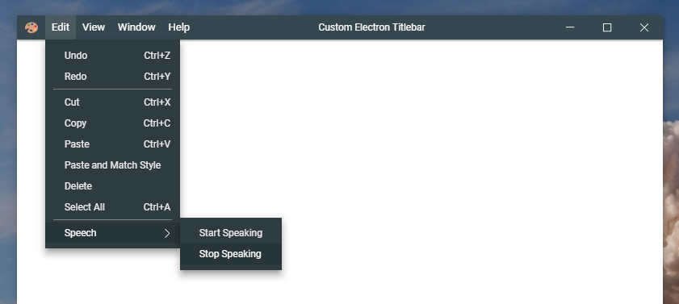
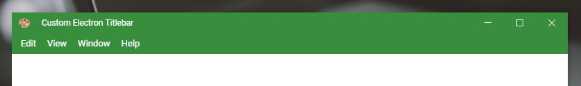
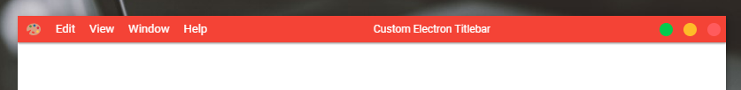

# CET (before, Custom Electron Titlebar)

This project is a typescript library for electron that allows you to configure a fully customizable title bar.

[](https://github.com/Inceldes/cet/blob/master/LICENSE)
[](https://npmjs.org/package/@inceldes/cet)







## Install

If you were using `custom-electron-titlebar` uninstall using:

```
npm remove custom-electron-titlebar
```

Then install the new package

```
npm i @inceldes/cet
```

or use the base project [cet-quickstart](https://github.com/AlexTorresSk/cet-quickstart)

## Usage

In your renderer file or in a script tag of your html add:

```js
const customTitlebar = require('@inceldes/cet');

new customTitlebar.Titlebar({
	backgroundColor: customTitlebar.Color.fromHex('#444')
});
```

> if you are using _typescript_
```ts
import { Titlebar, Color } from '@inceldes/cet'

new Titlebar({
	backgroundColor: Color.fromHex('#ECECEC')
});
```

The parameter `backgroundColor: Color` is require, this should be `Color` type.
(View [Update Background](#update-background) for more details).

## Options

The interface [`TitleBarOptions`] is managed, which has the following configurable options for the title bar. Some parameters are optional.

| Parameter                | Type             | Description                                                                           | Default                   |
| ------------------------ | ---------------- | ------------------------------------------------------------------------------------- | ------------------------- |
| backgroundColor          | Color            | The background color of the titlebar.                                                 | #444444     |
| icon                     | string           | The icon shown on the left side of the title bar.                                     | null                      |
| iconsTheme               | Theme            | Style of the icons.                                                                   | Themebar.win              |
| shadow                   | boolean          | The shadow of the titlebar.                                                           | false                     |
| drag                     | boolean          | Define whether or not you can drag the window by holding the click on the title bar.  | true                      |
| minimizable              | boolean          | Enables or disables the option to minimize the window by clicking on the corresponding button in the title bar.                                    | true                      |
| maximizable              | boolean          | Enables or disables the option to maximize and un-maximize the window by clicking on the corresponding button in the title bar.                      | true                      |
| closeable                | boolean          | Enables or disables the option of the close window by clicking on the corresponding button in the title bar.                                       | true                      |
| order                    | string           | Set the order of the elements on the title bar. (`inverted`, `first-buttons`)         | null                      |
| titleHorizontalAlignment | string           | Set horizontal alignment of the window title. (`left`, `center`, `right`)             | center                    |
| menu                     | Electron.Menu    | The menu to show in the title bar.                                                    | Menu.getApplicationMenu() |
| menuPosition             | string           | The position of menubar on titlebar.                                                  | left 											|
| enableMnemonics          | boolean 					| Enable the mnemonics on menubar and menu items.																				| true											|
| itemBackgroundColor      | Color            | The background color when the mouse is over the item.                                 | rgba(0, 0, 0, .14)        |

## Methods

### Update Background

When this method is executed, as well as when the title bar is created, it is checked whether the color is light or dark, so that the color of the icons adapts to the background of the title bar.

```js
titlebar.updateBackground(new Color(new RGBA(0, 0, 0, .7)));
```

To assign colors you can use the following options Color.fromHex (), `new Color(new RGBA(r, g, b, a))`, `new Color(new HSLA(h, s, l, a))`, `new Color(new HSVA(h, s, v, a))` or `Color.BLUE`, `Color.RED`, etc.

### Update Title

This method updated the title of the title bar, If you change the content of the `title` tag, you should call this method for update the title.

```js
document.title = 'My new title';
titlebar.updateTitle();

// Or you can do as follows and avoid writing document.title
titlebar.updateTitle('New Title');
```

if this method is called and the title parameter is added, the title of the document is changed to that of the parameter.

### Update Icon

With this method you can update the icon. This method receives the url of the image _(it is advisable to use transparent image formats)_

```js
titlebar.updateIcon('./images/my-icon.svg');
```

### Update Menu

This method updates or creates the menu, to create the menu use remote.Menu and remote.MenuItem.

```js
const menu = new Menu();
menu.append(new MenuItem({
	label: 'Item 1',
	submenu: [
		{
			label: 'Subitem 1',
			click: () => console.log('Click on subitem 1')
		},
		{
			type: 'separator'
		}
	]
}));

menu.append(new MenuItem({
	label: 'Item 2',
	submenu: [
		{
			label: 'Subitem checkbox',
			type: 'checkbox',
			checked: true
		},
		{
			type: 'separator'
		},
		{
			label: 'Subitem with submenu',
			submenu: [
				{
					label: 'Submenu &item 1',
					accelerator: 'Ctrl+T'
				}
			]
		}
	]
}));

titlebar.updateMenu(menu);
```

### Update Menu Position

You can change the position of the menu bar. `left` and `bottom` are allowed.

```js
titlebar.updateMenuPosition('bottom');
```

### Set Horizontal Alignment

> setHorizontalAlignment method was contributed by [@MairwunNx](https://github.com/MairwunNx) :punch:

`left`, `center` and `right` are allowed

```js
titlebar.setHorizontalAlignment('right');
```

### Dispose

This method removes the title bar completely and all recorded events.

```js
titlebar.dispose();
```

## Contributing

Many thanks to all the people who support this project through issues and pull request.
If you want to contribute with this project, all the issues and pull request are welcome.

## License

<<<<<<< HEAD
This project is under the [MIT](https://github.com/Inceldes/cet/blob/master/LICENSE) license.
=======
This project is under the [MIT](https://github.com/AlexTorresSk/custom-electron-titlebar/blob/master/LICENSE) license.
>>>>>>> 4031133b260a8eb5207e3c4e7c5c6600fa0173e9
