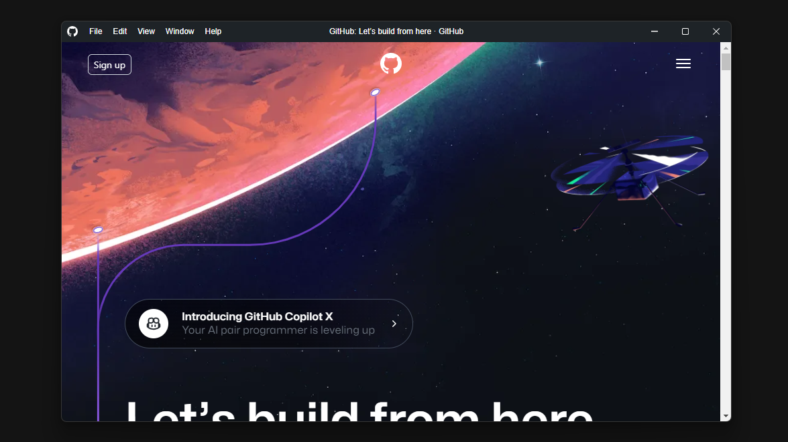
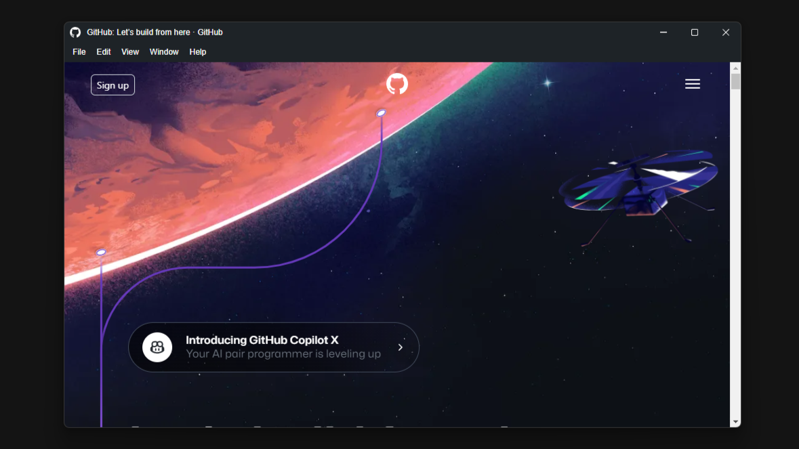
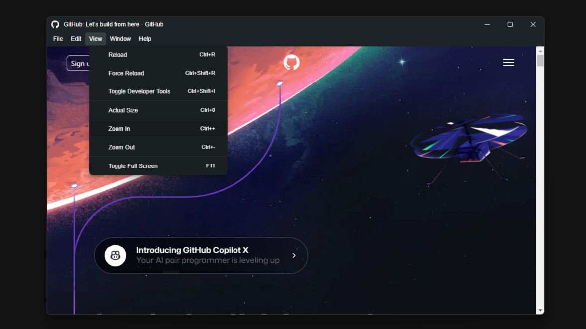
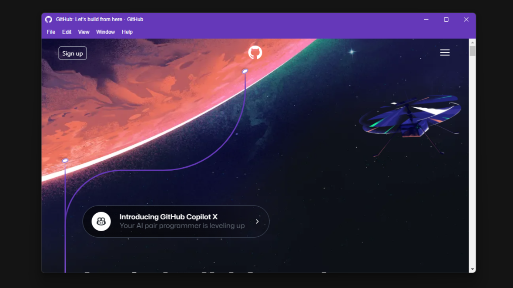

# Custom Electron Titlebar

This project is a typescript library for electron that allows you to configure a fully customizable title bar.

[](https://github.com/AlexTorresDev/custom-electron-titlebar/actions/workflows/build-release.yml)
[](https://github.com/AlexTorresDev/custom-electron-titlebar/blob/master/LICENSE)
[](https://npmjs.org/package/custom-electron-titlebar)
[](https://packagephobia.com/result?p=custom-electron-titlebar)

[📄 Visit Documentation](https://cet.alextrs.dev)

Standard Title Bar



Bottom Menu Bar



Menu



Custom color



# 📦 Installing
You can install this package with `npm`.
```sh
npm install custom-electron-titlebar
```

# 🛠️ Usage
The implementation is done as follows:

In the main application file (main.js or .ts)
```js
import { setupTitlebar, attachTitlebarToWindow } from "custom-electron-titlebar/main";

// setup the titlebar main process
setupTitlebar();

function createWindow() {
  // Create the browser window.
  const mainWindow = new BrowserWindow({
    width: 800,
    height: 600,
    titleBarStyle: 'hidden',
    //frame: false, // needed if process.versions.electron < 14
    webPreferences: {
      sandbox: false,
      preload: path.join(__dirname, 'preload.js')
    }
  });
  
  ...

  // attach fullScreen(f11 and not 'maximized') && focus listeners
  attachTitlebarToWindow(mainWindow);
}
```

In the preload file (preload.js or .ts)
```js
import { Titlebar } from "custom-electron-titlebar";

window.addEventListener('DOMContentLoaded', () => {
  // Title bar implementation
  new Titlebar();
});
```
To see the options you can include in the Title Bar constructor, such as color of elements, icons, menu position, and much more, and the methods you can use, go to the [wiki](https://github.com/AlexTorresDev/custom-electron-titlebar/wiki)

## 💰 Support
If you want to support my development, you can do so by donating through [💖 Sponsor](https://github.com/sponsors/AlexTorresDev)


## 📝 Contributors
I would like to express my sincere gratitude to all the people who have collaborated in the development and advancement of this project. I appreciate your contributions.

[](https://github.com/AlexTorresDev/custom-electron-titlebar/graphs/contributors)


## ✅ License
This project is under the [MIT](https://github.com/AlexTorresDev/custom-electron-titlebar/blob/master/LICENSE) license.
