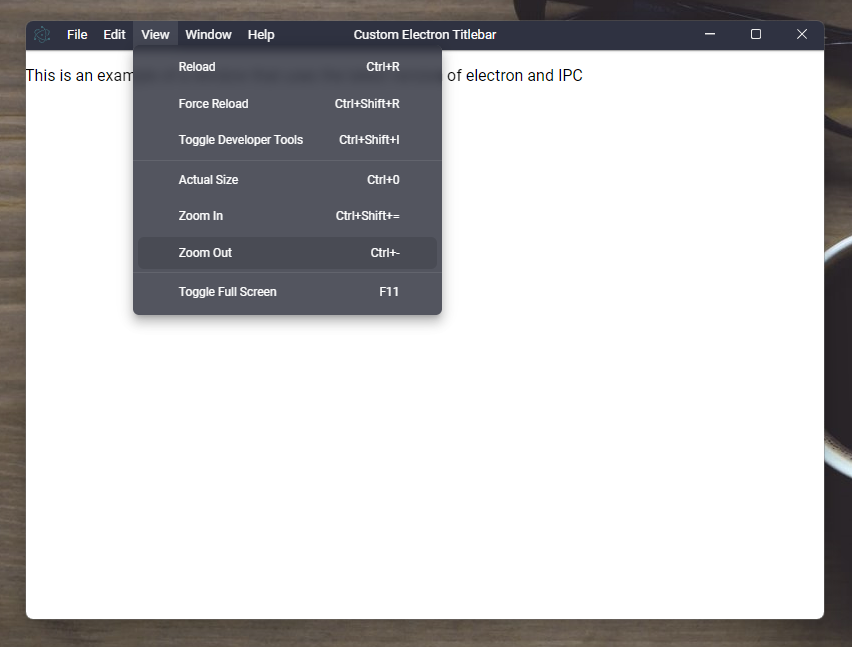
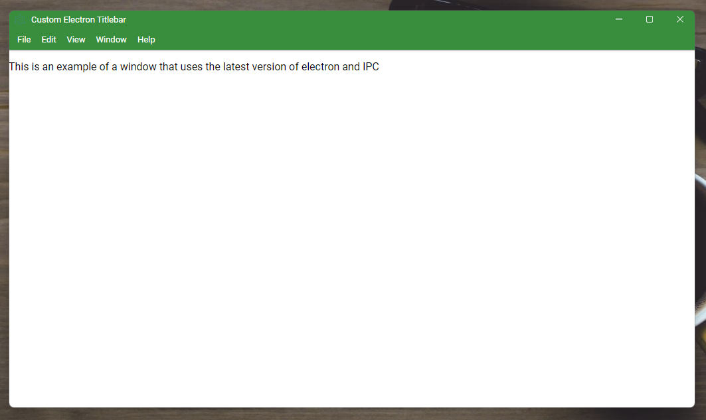

# Custom Electron Titlebar 4

This project is a typescript library for electron that allows you to configure a fully customizable title bar.

[](https://github.com/AlexTorresSk/custom-electron-titlebar/blob/master/LICENSE)
[](https://npmjs.org/package/custom-electron-titlebar)




## Install

```
npm i custom-electron-titlebar
```

or use example folder to init basic electron project with this titlebar.

## Usage

#### Step 1
In your **preload** file add:

For javascript

```js
const customTitlebar = require('custom-electron-titlebar');

new customTitlebar.Titlebar({
	backgroundColor: customTitlebar.Color.fromHex('#ECECEC')
});
```

For typescript
```ts
import { Titlebar, Color } from 'custom-electron-titlebar'

new Titlebar({
	backgroundColor: Color.fromHex('#ECECEC')
});
```

The parameter `backgroundColor: Color` is required, this should be `Color` type.
(View [Update Background](#update-background) for more details).

#### Step 2
Update the code that launches browser window
```js
let mainWindow = new BrowserWindow({
    width: 1000,
    height: 600,
    titleBarStyle: "hidden", // add this line
	webPreferences: {
      	preload: path.join(__dirname, 'preload.js')
    }
});
```

## Options

The interface [`TitleBarOptions`] is managed, which has the following configurable options for the title bar. Some parameters are optional.

| Parameter                      | Type                      | Description                                                                                                                     | Default                   |
| ------------------------------ | ------------------------- | ------------------------------------------------------------------------------------------------------------------------------- | ------------------------- |
| backgroundColor **(required)** | Color                     | The background color of the titlebar.                                                                                           | #444444                   |
| icon                           | string                    | The icon shown on the left side of the title bar.                                                                               | null                      |
| shadow                         | boolean                   | The shadow of the titlebar.                                                                                                     | false                     |
| drag                           | boolean                   | Define whether or not you can drag the window by holding the click on the title bar.                                            | true                      |
| onMinimize                     | Funtion                   | Enables or disables the option to minimize the window by clicking on the corresponding button in the title bar.                 | undefined                 |
| onMaximize                     | Funtion                   | Enables or disables the option to maximize and un-maximize the window by clicking on the corresponding button in the title bar. | undefined                 |
| onClose                        | Funtion                   | Enables or disables the option of the close window by clicking on the corresponding button in the title bar.                    | undefined                 |
| isMaximized                    | Funtion                   | Check if window is maximized.                                                                                                   | undefined                 |
| onMenuItemClick                | Funtion(commandId: number)| Fires when any menu option is pressed.                                                                                          | undefined                 |
| order                          | string                    | Set the order of the elements on the title bar. (`inverted`, `first-buttons`)                                                   | null                      |
| titleHorizontalAlignment       | string                    | Set horizontal alignment of the window title. (`left`, `center`, `right`)                                                       | center                    |
| menuPosition                   | string                    | The position of menubar on titlebar.                                                                                            | left 	  				   |
| enableMnemonics                | boolean 		             | Enable the mnemonics on menubar and menu items.																		           | true                      |
| hideWhenClickingClose          | boolean                   | When the close button is clicked, the window is hidden instead of closed.                                                       | false                     |
| overflow                       | string                    | The overflow of the container (`auto`, `visible`, `hidden`)                                                                     | auto                      |
| unfocusEffect                  | boolean                   | Enables or disables the blur option in the title bar.                                                                           | false                     |

## Methods

### Update Background

This change the color of titlebar and it's checked whether the color is light or dark, so that the color of the icons adapts to the background of the title bar.

```js
titlebar.updateBackground(new Color(new RGBA(0, 0, 0, .7)));
```

To assign colors you can use the following options: `Color.fromHex()`, `new Color(new RGBA(r, g, b, a))`, `new Color(new HSLA(h, s, l, a))`, `new Color(new HSVA(h, s, v, a))` or `Color.BLUE`, `Color.RED`, etc.

### Update Items Background Color

This method change background color on hover of items of menubar.

```js
titlebar.updateItemBGColor(new Color(new RGBA(0, 0, 0, .7)));
```

To assign colors you can use the following options: `Color.fromHex()`, `new Color(new RGBA(r, g, b, a))`, `new Color(new HSLA(h, s, l, a))`, `new Color(new HSVA(h, s, v, a))` or `Color.BLUE`, `Color.RED`, etc.

### Update Title

This method updated the title of the title bar, If you change the content of the `title` tag, you should call this method for update the title.

```js
document.title = 'My new title';
titlebar.updateTitle();

// Or you can do as follows and avoid writing document.title
titlebar.updateTitle('New Title');
```

if this method is called and the title parameter is added, the title of the document is changed to that of the parameter.

### Update Icon

With this method you can update the icon. This method receives the url of the image _(it is advisable to use transparent image formats)_

```js
titlebar.updateIcon('./images/my-icon.svg');
```

### Update Menu Position

You can change the position of the menu bar. `left` and `bottom` are allowed.

```js
titlebar.updateMenuPosition('bottom');
```

### Set Horizontal Alignment

You can change the position of the title of title bar. `left`, `center` and `right` are allowed

```js
titlebar.setHorizontalAlignment('right');
```

### Dispose

This method removes the title bar completely and all recorded events.

```js
titlebar.dispose();
```

## License

This project is under the [MIT](https://github.com/AlexTorresSk/custom-electron-titlebar/blob/master/LICENSE) license.
