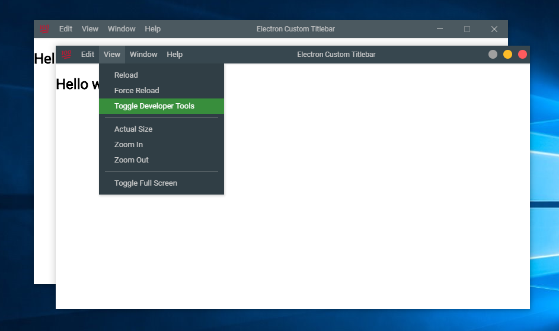

# Custom Electron Titlebar

This is an typescript / javascript library for electron that allows you to configure a fully customizable title bar.



## Whats new? v2.1.0
- **Now the menu is working.**
- Fixed the error of [#2](https://github.com/AlexTorresSk/custom-electron-titlebar/issues/2) when the main electron file is `.ts`
- Changed `Themebar.win()` to `Themebar.win`
- Changed `Themebar.mac()` to `Themebar.mac`

## Install

```
npm i custom-electron-titlebar
```

or use the base project [custom-electron-titlebar-quickstart](https://github.com/AlexTorresSk/custom-electron-titlebar-quickstart)

## Usage

In your renderer file or in html add:

```js
const customTitlebar = require('custom-electron-titlebar');

new customTitlebar.Titlebar('#444', {
	icon: 'appicon.svg',
	minimizable: false
});
```

> if you are using _typescript_
```ts
import { Titlebar, Themebar } from 'custom-electron-titlebar'

new Titlebar('#ECECEC', {
	icon: 'appicon.png'
});
```

The parameter `backgroundColor: string` is require, this can be rgba(), hls(), rgb(), hexadecimal.
(View [Set Background](#set-background) for more details).

## Options

The interface [`TitleBarConstructorOptions`](https://github.com/AlexTorresSk/custom-electron-titlebar/tree/master/src/options.ts) is managed, which has the following configurable options for the title bar. This parameter is optional.

| Parameter          | Type             | Description                                                                           | Default                   |
| ------------------ | ---------------- | ------------------------------------------------------------------------------------- | ------------------------- |
| icon               | string           | The icon shown on the left side of the title bar.                                     | Empty                     |
| iconsStyle         | HTMLStyleElement | Style of the icons.                                                                   | TitleBarIconStyle.win()   |
| shadow             | string           | The shadow of the titlebar. **This property is equal to box-shadow**                  | Empty                     |
| menu               | Electron.Menu    | The menu to show in the title bar.                                                    | Menu.getApplicationMenu() |
| drag               | boolean          | Define whether or not you can drag the window by holding the click on the title bar.  | true                      |
| minimizable        | boolean          | Define if the minimize window button is displayed.                                    | true                      |
| maximizable        | boolean          | Define if the maximize and restore window buttons are displayed.                      | true                      |
| closeable          | boolean          | Define if the close window button is displayed.                                       | true                      |
| order              | string           | Set the order of the elements on the title bar. (`normal`, `reverse`, `firstButtons`) | normal                    |
| menuItemHoverColor | string           | The background color when the mouse is over the item                                  | rgba(0, 0, 0, .14)           |

## Methods

### Set Background

When this method is executed, as well as when the title bar is created, it is checked whether the color is light or dark, so that the color of the icons adapts to the background of the title bar.

```js
const customTitlebar = require('custom-electron-titlebar');

const titlebar = new customTitlebar.Titlebar('rgba(0, 0, 0, .7)');

titlebar.setBackground('#444444');
```

### Update Title

This method updated the title of the title bar, If you change the content of the `title` tag, you should call this method for update the title.

```js
const customTitlebar = require('custom-electron-titlebar');

const titlebar = new customTitlebar.Titlebar('rgba(0, 0, 0, .7)');

document.title = 'My new title';
titlebar.updateTitle();

// Or you can do as follows and avoid writing document.title
titlebar.updateTitle('New Title');
```

### Set Menu

This method updates or creates the menu, to create the menu use remote.Menu and remote.MenuItem.

```js
const { Menu, MenuItem } = require('electron').remote;
const customTitlebar = require('custom-electron-titlebar');

const titlebar = new customTitlebar.Titlebar('rgba(0, 0, 0, .7)');

const menu = new Menu();
menu.append(new MenuItem({
	label: 'Item 1',
	submenu: [
		{
			label: 'Subitem 1',
			click() { console.log('Click on subitem 1') }
		},
		{
			type: 'separator'
		}
	]
}));

menu.append(new MenuItem({
	label: 'Item 2',
	submenu: [
		{
			label: 'Subitem checkbox',
			type: 'checkbox',
			checked: true
		},
		{
			type: 'separator'
		},
		{
			label: 'Subitem with submenu',
			submenu: [
				{
					label: 'Submenu &item 1',
					acelerator: 'Ctrl+T'
				}
			]
		}
	]
}));

titlebar.setMenu(menu);
```

### Set Theme Icons
You can create your custom theme for the icons, to get an idea of this see the [windows or mac](https://github.com/AlexTorresSk/custom-electron-titlebar/tree/master/src/themebar.ts) theme file.

```js
const fs = require('fs');
const customTitlebar = require('custom-electron-titlebar');

const titlebar = new customTitlebar.Titlebar('rgba(0, 0, 0, .7)');

const theme = document.createElement('style');
theme.textContent = fs.readFileSync('url of css file', 'utf8');
/* or
theme.textContent = `
	...style on css
`;
*/

titlebar.setThemeIcons(theme);
```