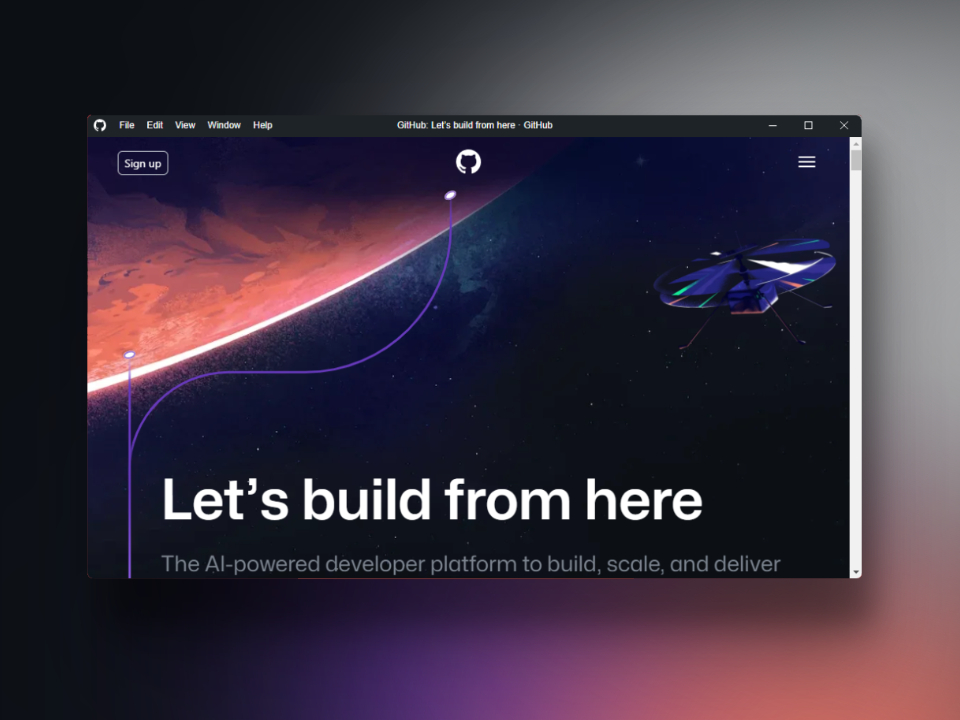
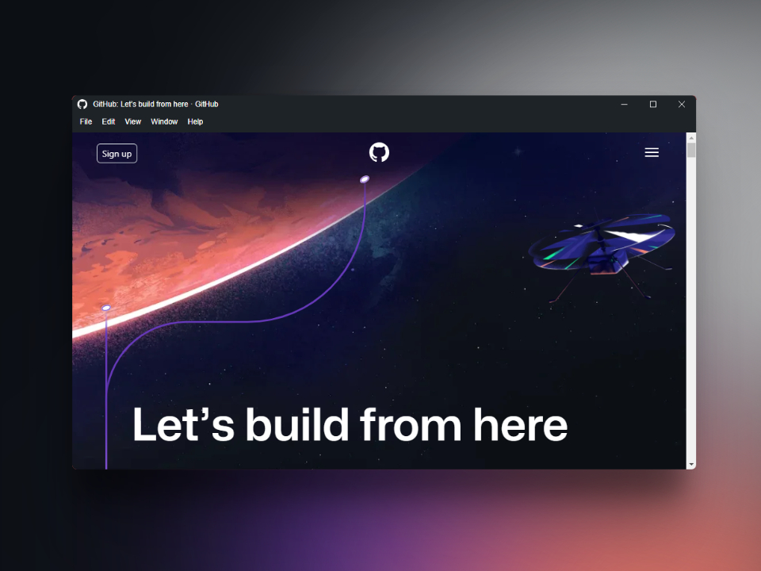
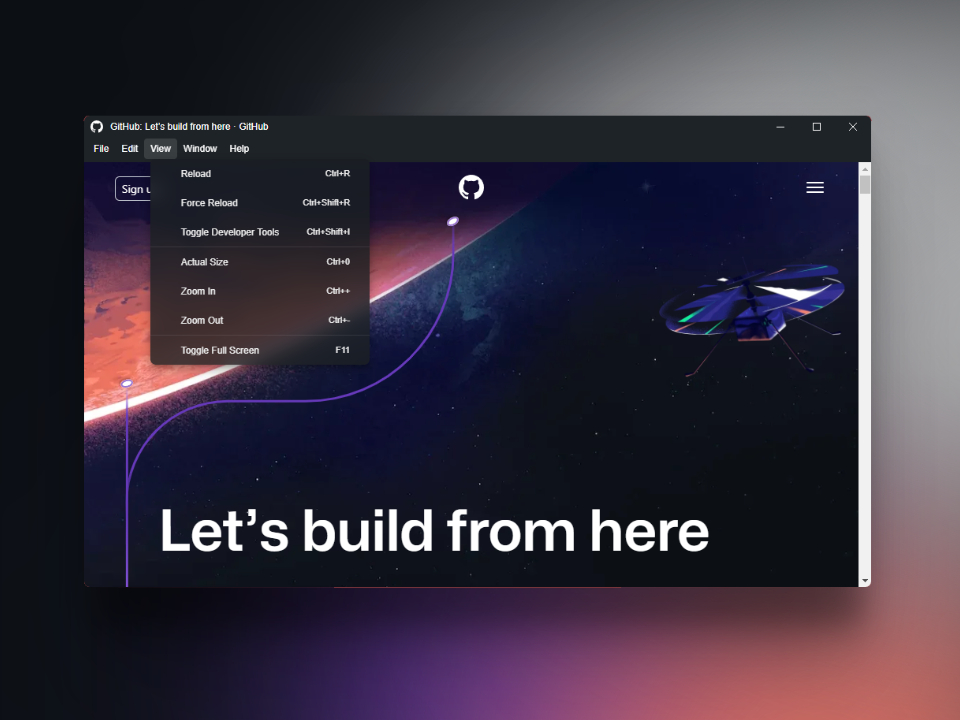
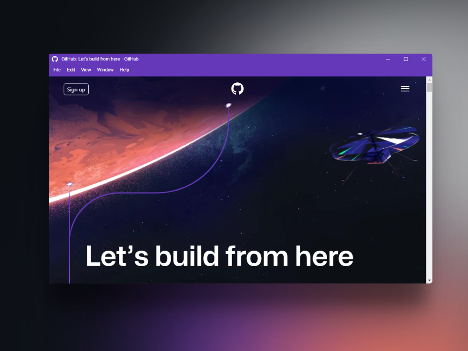

# Custom Electron Titlebar

This project is a typescript library for electron that allows you to configure a fully customizable title bar.

[](https://github.com/AlexTorresDev/custom-electron-titlebar/actions/workflows/build.yml)
[](https://github.com/AlexTorresDev/custom-electron-titlebar/blob/master/LICENSE)
[](https://npmjs.org/package/custom-electron-titlebar)
[](https://packagephobia.com/result?p=custom-electron-titlebar)


[📄 Documentation](https://github.com/AlexTorresDev/custom-electron-titlebar/wiki)

### Standard Title Bar



### Bottom Menu Bar



### Menu



### Custom color



# 📦 Installing
You can install this package with `npm`, `pnpm` or `yarn`.
```sh
npm install custom-electron-titlebar
```
```sh
pnpm add custom-electron-titlebar
```
```sh
yarn add custom-electron-titlebar
```

# 🛠️ Usage
The implementation is done as follows:

In the main application file (main.js or .ts)
```js
import { setupTitlebarAndAttachToWindow } from "custom-electron-titlebar/main";

function createWindow() {
  // Create the browser window.
  const mainWindow = new BrowserWindow({
    width: 800,
    height: 600,
    //frame: false, // needed if process.versions.electron < 14
    titleBarStyle: 'hidden',
    /* You can use *titleBarOverlay: true* to use the original Windows controls */
    titleBarOverlay: true,
    webPreferences: {
      sandbox: false,
      preload: path.join(__dirname, 'preload.js')
    }
  });
  
  ...

  // Setup main IPC + attach window listeners + load theme config
  setupTitlebarAndAttachToWindow(mainWindow, {
    themeConfigPath: path.join(__dirname, "titlebar.theme.json")
  });
}
```

In the preload file (preload.js or .ts)
```js
import { createTitlebarOnDOMContentLoaded } from "custom-electron-titlebar";

// Theme configuration is automatically loaded from main process
createTitlebarOnDOMContentLoaded();
```

**Theme Configuration:**

Themes are loaded in the main process and delivered to the renderer via IPC. Specify the theme file path in `setupTitlebarAndAttachToWindow()` options:

Theme JSON schema (v1):
```json
{
  "version": 1,
  "fontFamily": "Segoe UI, Arial, sans-serif",
  "fontSize": 13,
  "colors": {
    "titlebar": "#1f2430",
    "titlebarForeground": "#f3f4f6",
    "menuBar": "#181c25",
    "menuItemSelection": "#2f3a4f",
    "menuSeparator": "#4b5563",
    "svg": "#e5e7eb"
  }
}
```

To see the options you can include in the Title Bar constructor, such as color of elements, icons, menu position, and much more, and the methods you can use, go to the [wiki](https://github.com/AlexTorresDev/custom-electron-titlebar/wiki)

## 💰 Support
If you want to support my development, you can do so by donating through [💖 Sponsor](https://github.com/sponsors/AlexTorresDev)


## 📝 Contributors
I would like to express my sincere gratitude to all the people who have collaborated in the development and advancement of this project. I appreciate your contributions.

[](https://github.com/AlexTorresDev/custom-electron-titlebar/graphs/contributors)


## ✅ License
This project is under the [MIT](https://github.com/AlexTorresDev/custom-electron-titlebar/blob/master/LICENSE) license.
